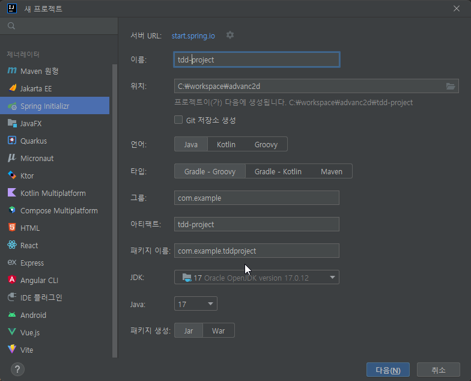
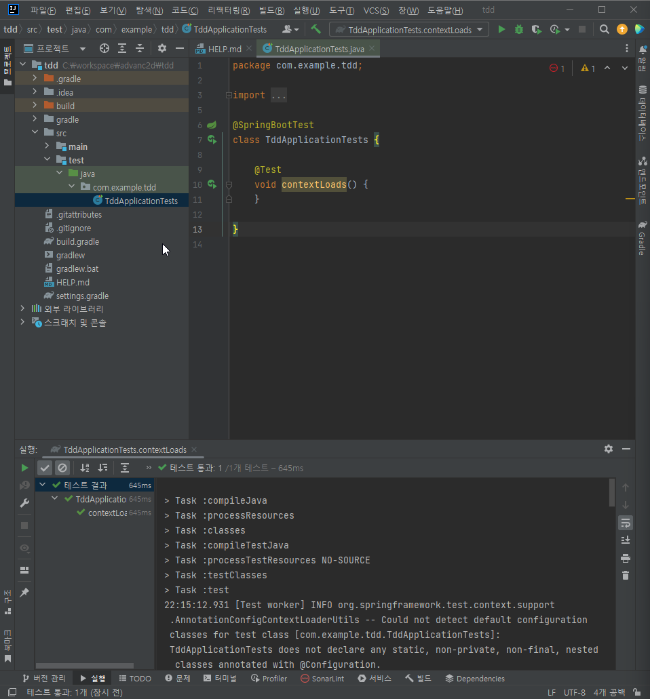
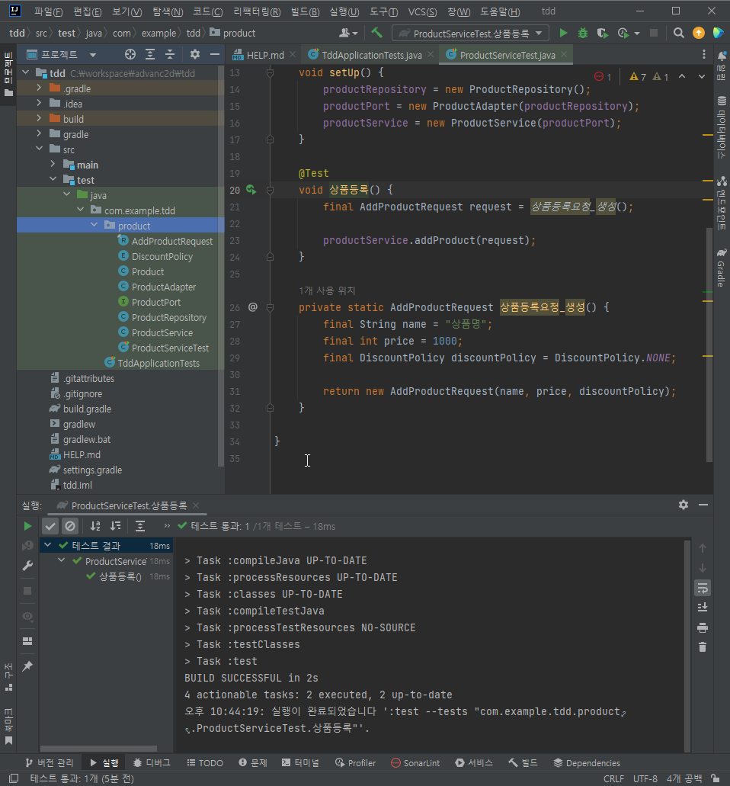
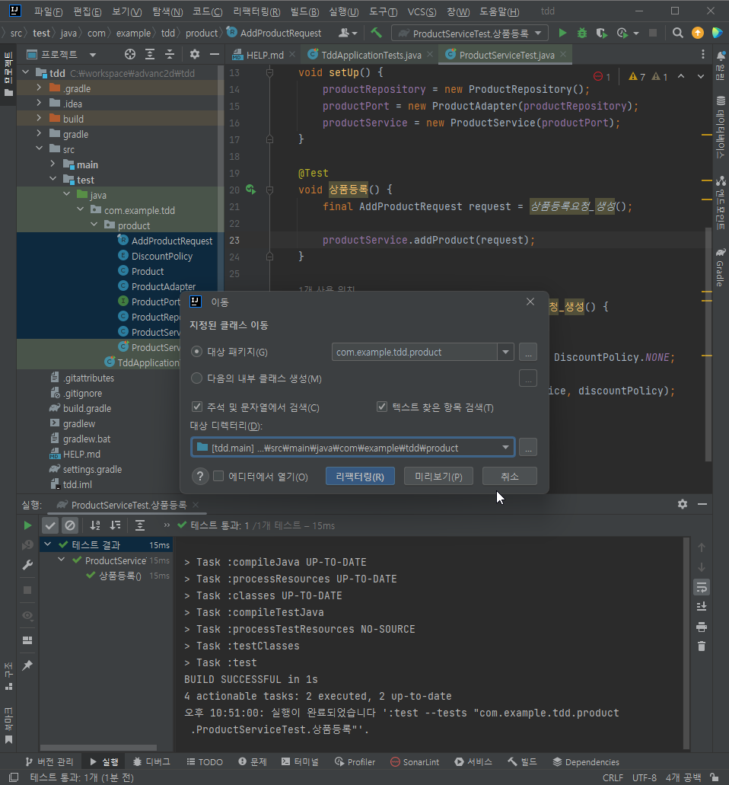
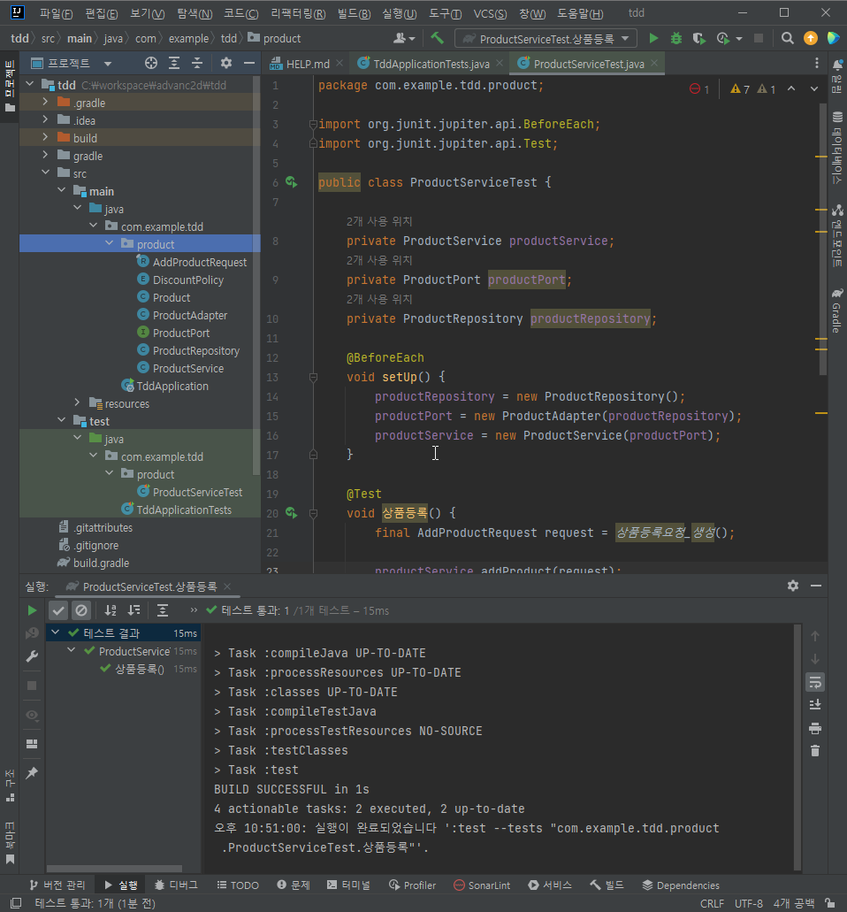
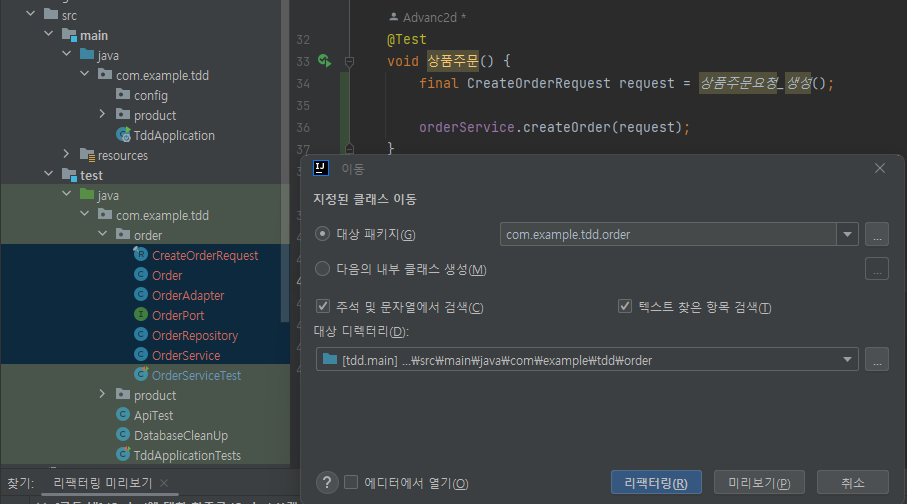

# **상품 - 주문 API 개발로 알아보는 TDD**

---

- 출처 : [`inflearn 강의`](https://www.inflearn.com/course/%EC%8A%A4%ED%94%84%EB%A7%81%EB%B6%80%ED%8A%B8-%EC%8B%A4%EC%A0%84-%EC%83%81%ED%92%88%EC%A3%BC%EB%AC%B8-tdd/dashboard "실전! 스프링부트 상품-주문 API 개발로 알아보는 TDD")
- Test 코드 작성 후 클래스를 상위 클래스로 올린 후 Spring Boot Bean으로 확인 하는 순차 Test 코드 작성

---

## **TDD 란?**
- `Test Driven Development`, `테스트 주도 개발`이라고 한다.
- 반복 테스트를 이용한 소프트웨어 방법론으로 작은 단위의 테스트 케이스를 작성하고 이를 통과하는 코드를 추가하는 단계를 반복하여 구현해 나간다.
## **Project 생성**


- dependency - jpa, h2, lombok, web
- ```
   implementation 'org.springframework.boot:spring-boot-starter-data-jpa'
   implementation 'org.springframework.boot:spring-boot-starter-web'
   compileOnly 'org.projectlombok:lombok'
   runtimeOnly 'com.h2database:h2'
   annotationProcessor 'org.projectlombok:lombok'
   testImplementation 'org.springframework.boot:spring-boot-starter-test'
   testRuntimeOnly 'org.junit.platform:junit-platform-launcher'
  ```

## **1. 상품등록 API 개발**

### **1-1. Boot Project 로드 테스트**
- contextLoads 메소드 좌측의 실행 버튼을 이용하여 실행 후 테스트 결과 확인




### **1-2. POJO 상품 등록 기능 구현하기**
- product 패키지 생성
- ProductServiceTest 클래스 생성

```java
package com.example.tdd.product;

import org.junit.jupiter.api.BeforeEach;
import org.junit.jupiter.api.Test;
import org.springframework.util.Assert;

public class ProductServiceTest {

  private ProductService productService;

  @BeforeEach
  void setUp() {
    productService = new ProductService();
  }

  @Test
  void 상품등록() {
    final String name = "상품명";
    final int price = 1000;
    final DiscountPolicy discountPolicy = DiscountPolicy.NONE;

    final AddProductRequest request = new AddProductRequest(name, price, discountPolicy);
    productService.addProduct(request);
  }

  private class ProductService {
    public void addProduct(AddProductRequest request) {
    }
  }

  private record AddProductRequest(String name, int price, DiscountPolicy discountPolicy) {

    private AddProductRequest(final String name, final int price, final DiscountPolicy discountPolicy) {
      this.name = name;
      this.price = price;
      this.discountPolicy = discountPolicy;
      Assert.hasText(name, "상품명은 필수입니다.");
      Assert.isTrue(price > 0, "상품 가격은 0보다 커야합니다.");
      Assert.notNull(discountPolicy, "할인 정책은 필수입니다.");
    }
  }

  private enum DiscountPolicy {
    NONE
  }

}
```

### **1-3. POJO 상품 등록 기능 구현하기 2차**
- @Test 확인

```java
package com.example.tdd.product;

import org.junit.jupiter.api.BeforeEach;
import org.junit.jupiter.api.Test;
import org.springframework.util.Assert;

import java.util.HashMap;
import java.util.Map;

public class ProductServiceTest {

    private ProductService productService;
    private ProductPort productPort;
    private ProductRepository productRepository;

    @BeforeEach
    void setUp() {
        productRepository = new ProductRepository();
        productPort = new ProductAdapter(productRepository);
        productService = new ProductService(productPort);
    }

    @Test
    void 상품등록() {
        final String name = "상품명";
        final int price = 1000;
        final DiscountPolicy discountPolicy = DiscountPolicy.NONE;

        final AddProductRequest request = new AddProductRequest(name, price, discountPolicy);
        productService.addProduct(request);
    }

    private class ProductService {
        private final ProductPort productPort;

        private ProductService(ProductPort productPort) {
            this.productPort = productPort;
        }

        public void addProduct(AddProductRequest request) {
            final Product product = new Product(request.name(), request.price(), request.discountPolicy());

            productPort.save(product);
        }
    }

    private record AddProductRequest(String name, int price, DiscountPolicy discountPolicy) {

            private AddProductRequest(final String name, final int price, final DiscountPolicy discountPolicy) {
                this.name = name;
                this.price = price;
                this.discountPolicy = discountPolicy;
                Assert.hasText(name, "상품명은 필수입니다.");
                Assert.isTrue(price > 0, "상품 가격은 0보다 커야합니다.");
                Assert.notNull(discountPolicy, "할인 정책은 필수입니다.");
            }
        }

    private enum DiscountPolicy {
        NONE
    }

    private class Product {
        private Long id;
        private final String name;
        private final int price;
        private final DiscountPolicy discountPolicy;

        public Product(String name, int price, DiscountPolicy discountPolicy) {
            Assert.hasText(name, "상품명은 필수입니다.");
            Assert.isTrue(price > 0, "상품 가격은 0보다 커야합니다.");
            Assert.notNull(discountPolicy, "할인 정책은 필수입니다.");
            this.name = name;
            this.price = price;
            this.discountPolicy = discountPolicy;
        }

        public void assignId(Long id) {
            this.id = id;
        }

        public Long getId() {
            return id;
        }
    }

    private interface ProductPort {
        void save(Product product);
    }

    private class ProductAdapter implements ProductPort {
        private final ProductRepository productRepository;

        private ProductAdapter(ProductRepository productRepository) {
            this.productRepository = productRepository;
        }

        @Override
        public void save(Product product) {
            productRepository.save(product);
        }
    }

    private class ProductRepository {
        private Map<Long, Product> persistence = new HashMap<>();
        private Long sequence = 0L;

        public void save(Product product) {
            product.assignId(++sequence);
            persistence.put(product.getId(), product);
        }
    }
}
```

### **1-4. 내부클래스를 상위 클래스로 이동 / 단축키: F6**
- Test 클래스 제외 모두 상위로 이동


### **1-5. Test 확인**

### **1-6. test 폴더의 클래스들을 main으로 이동**



## **2. Spring Boot Bean으로 테스트 전환하기**

### **2-1. 어노테이션 추가**
- @Component
  - ProductService.java
  - ProductAdapter.java
- @Repository
  - ProductRepository.java

```java
package com.example.tdd.product;

import org.springframework.stereotype.Component;
import org.springframework.transaction.annotation.Transactional;

@Component
class ProductService {
    private final ProductPort productPort;

    ProductService(ProductPort productPort) {
        this.productPort = productPort;
    }

    @Transactional
    public void addProduct(AddProductRequest request) {
        final Product product = new Product(request.name(), request.price(), request.discountPolicy());

        productPort.save(product);
    }
}
```

```java
package com.example.tdd.product;

import org.springframework.stereotype.Component;

@Component
class ProductAdapter implements ProductPort {
    private final ProductRepository productRepository;

    ProductAdapter(ProductRepository productRepository) {
        this.productRepository = productRepository;
    }

    @Override
    public void save(Product product) {
        productRepository.save(product);
    }
}
```

```java
package com.example.tdd.product;

import org.springframework.stereotype.Repository;

import java.util.HashMap;
import java.util.Map;

@Repository
class ProductRepository {
    private Map<Long, Product> persistence = new HashMap<>();
    private Long sequence = 0L;

    public void save(Product product) {
        product.assignId(++sequence);
        persistence.put(product.getId(), product);
    }
}
```

### **2-2. ProductServiceTest 클래스 @Autowired로 변환**
```java
package com.example.tdd.product;

import org.junit.jupiter.api.Test;
import org.springframework.beans.factory.annotation.Autowired;
import org.springframework.boot.test.context.SpringBootTest;

@SpringBootTest
public class ProductServiceTest {

    @Autowired
    private ProductService productService;

    @Test
    void 상품등록() {
        final AddProductRequest request = 상품등록요청_생성();

        productService.addProduct(request);
    }

    private static AddProductRequest 상품등록요청_생성() {
        final String name = "상품명";
        final int price = 1000;
        final DiscountPolicy discountPolicy = DiscountPolicy.NONE;

        return new AddProductRequest(name, price, discountPolicy);
    }

}
```

## **3. API 테스트로 전환**

### **3-1. gradle 의존성 추가**
```shell
testImplementation group: 'io.rest-assured', name: 'rest-assured', version: '4.4.0'
```
### **3-2. ApiTest 클래스 추가**
```java
package com.example.tdd;

import io.restassured.RestAssured;
import org.junit.jupiter.api.BeforeEach;
import org.springframework.boot.test.context.SpringBootTest;
import org.springframework.boot.test.web.server.LocalServerPort;

@SpringBootTest(webEnvironment = SpringBootTest.WebEnvironment.RANDOM_PORT)
public class ApiTest {

  @LocalServerPort
  private int port;

  @BeforeEach
  void setUp() {
    RestAssured.port = port;
  }
}
```

### **3-3. ProductServiceTest -> ProductApiTest로 Rename 및 API 요청**
```java
package com.example.tdd.product;

import com.example.tdd.ApiTest;
import io.restassured.RestAssured;
import io.restassured.response.ExtractableResponse;
import io.restassured.response.Response;
import org.junit.jupiter.api.Test;
import org.springframework.http.HttpStatus;
import org.springframework.http.MediaType;

import static org.assertj.core.api.Assertions.assertThat;

public class ProductApiTest extends ApiTest {

  @Test
  void 상품등록() {
    final AddProductRequest request = 상품등록요청_생성();

    final ExtractableResponse<Response> response = 
            RestAssured.given().log().all()         // 요청 로그를 남김
            .contentType(MediaType.APPLICATION_JSON_VALUE)
            .body(request)
            .when()
            .post("/products")
            .then()
            .log().all().extract();

    assertThat(response.statusCode()).isEqualTo(HttpStatus.CREATED.value());
  }

  private static AddProductRequest 상품등록요청_생성() {
    final String name = "상품명";
    final int price = 1000;
    final DiscountPolicy discountPolicy = DiscountPolicy.NONE;

    return new AddProductRequest(name, price, discountPolicy);
  }

}
```

### **3-3. ProductService Controller 매핑**

```java
package com.example.tdd.product;

import org.springframework.http.HttpStatus;
import org.springframework.http.ResponseEntity;
import org.springframework.stereotype.Component;
import org.springframework.transaction.annotation.Transactional;
import org.springframework.web.bind.annotation.PostMapping;
import org.springframework.web.bind.annotation.RequestBody;
import org.springframework.web.bind.annotation.RequestMapping;
import org.springframework.web.bind.annotation.RestController;

@RestController
@RequestMapping("/products")
class ProductService {
    private final ProductPort productPort;

    ProductService(ProductPort productPort) {
        this.productPort = productPort;
    }

    @PostMapping
    public ResponseEntity addProduct(@RequestBody final AddProductRequest request) {
        final Product product = new Product(request.name(), request.price(), request.discountPolicy());

        productPort.save(product);

        return ResponseEntity.status(HttpStatus.CREATED).build();
    }
}
```

### **3-4. Test 상품등록 실행**
```shell
Request method:	POST
Request URI:	http://localhost:55287/products
Proxy:			<none>
Request params:	<none>
Query params:	<none>
Form params:	<none>
Path params:	<none>
Headers:		Accept=*/*
				Content-Type=application/json
Cookies:		<none>
Multiparts:		<none>
Body:
{
    "name": "상품명",
    "price": 1000,
    "discountPolicy": "NONE"
}
2024-11-03 00:13:10.703  INFO 22664 --- [o-auto-1-exec-2] o.a.c.c.C.[Tomcat].[localhost].[/]       : Initializing Spring DispatcherServlet 'dispatcherServlet'
2024-11-03 00:13:10.704  INFO 22664 --- [o-auto-1-exec-2] o.s.web.servlet.DispatcherServlet        : Initializing Servlet 'dispatcherServlet'
2024-11-03 00:13:10.705  INFO 22664 --- [o-auto-1-exec-2] o.s.web.servlet.DispatcherServlet        : Completed initialization in 1 ms
HTTP/1.1 201 
Content-Length: 0
Date: Sat, 02 Nov 2024 15:13:10 GMT
Keep-Alive: timeout=60
Connection: keep-alive

```

### **3-5. Test 성공 후 리팩토링**
```java
package com.example.tdd.product;

import com.example.tdd.ApiTest;
import io.restassured.RestAssured;
import io.restassured.response.ExtractableResponse;
import io.restassured.response.Response;
import org.junit.jupiter.api.Test;
import org.springframework.http.HttpStatus;
import org.springframework.http.MediaType;

import static org.assertj.core.api.Assertions.assertThat;

public class ProductApiTest extends ApiTest {

//    @Autowired
//    private ProductService productService;

    @Test
    void 상품등록() {
        final var request = 상품등록요청_생성();
//        productService.addProduct(request);

        final var response = 상품등록요청(request);

        assertThat(response.statusCode()).isEqualTo(HttpStatus.CREATED.value());
    }

    private static ExtractableResponse<Response> 상품등록요청(final AddProductRequest request) {
        return RestAssured.given().log().all()         // 요청 로그를 남김
                .contentType(MediaType.APPLICATION_JSON_VALUE)
                .body(request)
                .when()
                .post("/products")
                .then()
                .log().all().extract();
    }

    private static AddProductRequest 상품등록요청_생성() {
        final String name = "상품명";
        final int price = 1000;
        final DiscountPolicy discountPolicy = DiscountPolicy.NONE;

        return new AddProductRequest(name, price, discountPolicy);
    }

}
```

## **4. JPA 사용으로 전환**
### **4-1. ProductRepository**
- JpaRepository 상속
```java
package com.example.tdd.product;

import org.springframework.data.jpa.repository.JpaRepository;
import org.springframework.stereotype.Repository;

import java.util.HashMap;
import java.util.Map;

@Repository
interface ProductRepository extends JpaRepository<Product, Long> {
}
```

### **4-2. ProductEntity**
- `@Entity`, `@Table` 등 정의
```java
package com.example.tdd.product;

import lombok.AccessLevel;
import lombok.Getter;
import lombok.NoArgsConstructor;
import org.springframework.util.Assert;

import javax.persistence.*;

@Entity
@Table(name = "products")
@Getter
@NoArgsConstructor(access = AccessLevel.PROTECTED)
class Product {
  @Id
  @GeneratedValue(strategy = GenerationType.IDENTITY)
  private Long id;

  private String name;

  private int price;

  private DiscountPolicy discountPolicy;

  public Product(String name, int price, DiscountPolicy discountPolicy) {
    Assert.hasText(name, "상품명은 필수입니다.");
    Assert.isTrue(price > 0, "상품 가격은 0보다 커야합니다.");
    Assert.notNull(discountPolicy, "할인 정책은 필수입니다.");
    this.name = name;
    this.price = price;
    this.discountPolicy = discountPolicy;
  }
}
```

### **4-3. ProductService**
- `@Transactional` 추가
```java
package com.example.tdd.product;

import org.springframework.http.HttpStatus;
import org.springframework.http.ResponseEntity;
import org.springframework.transaction.annotation.Transactional;
import org.springframework.web.bind.annotation.PostMapping;
import org.springframework.web.bind.annotation.RequestBody;
import org.springframework.web.bind.annotation.RequestMapping;
import org.springframework.web.bind.annotation.RestController;

@RestController
@RequestMapping("/products")
class ProductService {
  private final ProductPort productPort;

  ProductService(ProductPort productPort) {
    this.productPort = productPort;
  }

  @PostMapping
  @Transactional
  public ResponseEntity addProduct(@RequestBody final AddProductRequest request) {
    final Product product = new Product(request.name(), request.price(), request.discountPolicy());

    productPort.save(product);

    return ResponseEntity.status(HttpStatus.CREATED).build();
  }
}

```

### **4-4. application.properties**
- properties 추가
```properties
spring.jpa.properties.hibernate.show_sql=true
spring.jpa.properties.hibernate.format_sql=true
```


### **4-5. log 확인**
```
Hibernate:

    drop table if exists products CASCADE 
Hibernate:

    create table products (
       id bigint generated by default as identity,
        discount_policy integer,
        name varchar(255),
        price integer not null,
        primary key (id)
    )
    
Hibernate: 
    insert 
    into
        products
        (id, discount_policy, name, price) 
    values
        (default, ?, ?, ?)
```

### **4-5. Test마다 Database 초기화를 위한 DatabaseCleanup.java 추가**
- guava 라이브러리 추가
```properties
    implementation 'com.google.guava:guava:31.1-jre'
```
- DatabaseCleanup.java
```java
package com.example.tdd;

import com.google.common.base.CaseFormat;
import org.springframework.beans.factory.InitializingBean;
import org.springframework.stereotype.Component;
import org.springframework.transaction.annotation.Transactional;

import javax.persistence.Entity;
import javax.persistence.EntityManager;
import javax.persistence.PersistenceContext;
import javax.persistence.Table;
import javax.persistence.metamodel.EntityType;
import java.util.List;
import java.util.Set;
import java.util.stream.Collectors;

@Component
public class DatabaseCleanUp implements InitializingBean {

  @PersistenceContext
  private EntityManager entityManager;

  private List<String> tableNames;

  @Override
  public void afterPropertiesSet() {
    // entityManager에서 JPA Entity 데이터를 모두 가져옴
    final Set<EntityType<?>> entities = entityManager.getMetamodel().getEntities();
    tableNames = entities.stream()
            .filter(e -> isEntity(e) && hasTableAnnotation(e))  // Entity 어노테이션이 붙어있고 Table 어노테이션이 붙어있는지 확인
            .map(e -> {
              String tableName = e.getJavaType().getAnnotation(Table.class).name();   // 필터링된 데이터의 테이블명을 모두 가져옴
              return tableName.isBlank() ? CaseFormat.UPPER_CAMEL.to(CaseFormat.LOWER_UNDERSCORE, e.getName()) : tableName;
            })
            .collect(Collectors.toList());

    final List<String> entityNames = entities.stream()
            .filter(e -> isEntity(e) && !hasTableAnnotation(e)) // Entity 어노테이션이 붙어있고 Table 어노테이션이 붙어있지 않은 것들 필터링
            .map(e -> CaseFormat.UPPER_CAMEL.to(CaseFormat.LOWER_UNDERSCORE, e.getName()))
            .toList();

    tableNames.addAll(entityNames);
  }

  private boolean isEntity(final EntityType<?> e) {
    return null != e.getJavaType().getAnnotation(Entity.class);
  }

  private boolean hasTableAnnotation(final EntityType<?> e) {
    return null != e.getJavaType().getAnnotation(Table.class);
  }

  @Transactional
  public void execute() {
    entityManager.flush();
    entityManager.createNativeQuery("SET REFERENTIAL_INTEGRITY FALSE").executeUpdate(); // 참조 무결성 무시

    for (final String tableName : tableNames) {
      entityManager.createNativeQuery("TRUNCATE TABLE " + tableName).executeUpdate(); // Table Truncate
      entityManager.createNativeQuery("ALTER TABLE " + tableName + " ALTER COLUMN ID RESTART WITH 1").executeUpdate();    // 컬럼의 ID 시퀀스 1 초기화
    }

    entityManager.createNativeQuery("SET REFERENTIAL_INTEGRITY TRUE").executeUpdate();
  }
}
```

### **4-6. ApiTest 클래스 수정**
```java
package com.example.tdd;

import io.restassured.RestAssured;
import org.junit.jupiter.api.BeforeEach;
import org.springframework.beans.factory.annotation.Autowired;
import org.springframework.boot.test.context.SpringBootTest;
import org.springframework.boot.test.web.server.LocalServerPort;

@SpringBootTest(webEnvironment = SpringBootTest.WebEnvironment.RANDOM_PORT)
public class ApiTest {

  @Autowired
  private DatabaseCleanUp databaseCleanUp;

  @LocalServerPort
  private int port;

  @BeforeEach
  void setUp() {
    if (RestAssured.port == RestAssured.UNDEFINED_PORT) {
      RestAssured.port = port;
      databaseCleanUp.afterPropertiesSet();
    }

    databaseCleanUp.execute();
  }
}

```

### **4-7. log 확인**
```
Hibernate:

    drop table if exists products CASCADE 
Hibernate:

    create table products (
       id bigint generated by default as identity,
        discount_policy integer,
        name varchar(255),
        price integer not null,
        primary key (id)
    )
    Hibernate: 
    
SET
    REFERENTIAL_INTEGRITY FALSE
Hibernate: 
    TRUNCATE TABLE products
Hibernate: 
    ALTER TABLE products ALTER COLUMN ID RESTART WITH 1
Hibernate: 
    
SET
    REFERENTIAL_INTEGRITY TRUE

Hibernate: 
    insert 
    into
        products
        (id, discount_policy, name, price) 
    values
        (default, ?, ?, ?)

Hibernate: 
    
    drop table if exists products CASCADE 
```

## **5. 상품 조회 기능 구현**

### **5-0. ProductServiceTest 추가**
- ProductServiceTest.java
```java
package com.example.tdd.product;

import org.junit.jupiter.api.Test;
import org.springframework.beans.factory.annotation.Autowired;
import org.springframework.boot.test.context.SpringBootTest;

import static org.assertj.core.api.AssertionsForClassTypes.assertThat;

@SpringBootTest
class ProductServiceTest {

  @Autowired
  private ProductService productService;

  @Test
  void 상품조회() {
    // 상품 등록
    productService.addProduct(ProiductSteps.상품등록요청_생성());
    final long productId = 1L;

    // 상품 조회
    final GetProductResponse response = productService.getProduct(productId);

    // 상품 응답 검증
    assertThat(response).isNotNull();
  }

}
```

### **5-1. ProductApiTest -> ProductSteps 메소드 이동 후 extends**
- ProductSteps.java
```java
package com.example.tdd.product;

import com.example.tdd.ApiTest;
import io.restassured.RestAssured;
import io.restassured.response.ExtractableResponse;
import io.restassured.response.Response;
import org.springframework.http.MediaType;

public class ProiductSteps extends ApiTest {
  public static ExtractableResponse<Response> 상품등록요청(final AddProductRequest request) {
    return RestAssured.given().log().all()         // 요청 로그를 남김
            .contentType(MediaType.APPLICATION_JSON_VALUE)
            .body(request)
            .when()
            .post("/products")
            .then()
            .log().all().extract();
  }

  public static AddProductRequest 상품등록요청_생성() {
    final String name = "상품명";
    final int price = 1000;
    final DiscountPolicy discountPolicy = DiscountPolicy.NONE;

    return new AddProductRequest(name, price, discountPolicy);
  }
}
```

- ProductApiTest.java
```java
package com.example.tdd.product;

import org.junit.jupiter.api.Test;
import org.springframework.http.HttpStatus;

import static org.assertj.core.api.Assertions.assertThat;

public class ProductApiTest extends ProiductSteps {

    @Test
    void 상품등록() {
        final var request = 상품등록요청_생성();

        final var response = 상품등록요청(request);

        assertThat(response.statusCode()).isEqualTo(HttpStatus.CREATED.value());
    }

}
```

### **5-2. GetProductResponse 추가**
- GetProductResponse.java
```java
package com.example.tdd.product;

import org.springframework.util.Assert;

record GetProductResponse(
        long id,
        String name,
        int price,
        DiscountPolicy discountPolicy
) {
  GetProductResponse {
    Assert.notNull(id, "상품ID는 필수입니다.");
    Assert.hasText(name, "상품명은 필수입니다.");
    Assert.notNull(discountPolicy, "할인 정책은 필수입니다.");
  }
}
```

### **5-3. ProductService getProduct 메소드 추가**
- ProductService.java
```java
package com.example.tdd.product;

import org.springframework.http.HttpStatus;
import org.springframework.http.ResponseEntity;
import org.springframework.transaction.annotation.Transactional;
import org.springframework.web.bind.annotation.PostMapping;
import org.springframework.web.bind.annotation.RequestBody;
import org.springframework.web.bind.annotation.RequestMapping;
import org.springframework.web.bind.annotation.RestController;

@RestController
@RequestMapping("/products")
class ProductService {
  private final ProductPort productPort;

  ProductService(ProductPort productPort) {
    this.productPort = productPort;
  }

  @PostMapping
  @Transactional
  public ResponseEntity addProduct(@RequestBody final AddProductRequest request) {
    final Product product = new Product(request.name(), request.price(), request.discountPolicy());

    productPort.save(product);

    return ResponseEntity.status(HttpStatus.CREATED).build();
  }

  public GetProductResponse getProduct(long productId) {
    final Product product = productPort.getProdcut(productId);

    return new GetProductResponse(
            product.getId(),
            product.getName(),
            product.getPrice(),
            product.getDiscountPolicy()
    );
  }
}
```

### **5-4. ProductPort getProduct 메소드 추가**
- ProductPort.java
```java
package com.example.tdd.product;

interface ProductPort {
  void save(Product product);

  Product getProdcut(long productId);
}
```

### **5-5. ProductPort getProduct 메소드 추가**
- ProductPort.java
```java
package com.example.tdd.product;

interface ProductPort {
  void save(Product product);

  Product getProduct(Long productId);
}
```

### **5-6. ProductAdapter getProduct 메소드 추가**
- ProductAdapter.java
```java
package com.example.tdd.product;

import org.springframework.stereotype.Component;

@Component
class ProductAdapter implements ProductPort {
    private final ProductRepository productRepository;

    ProductAdapter(ProductRepository productRepository) {
        this.productRepository = productRepository;
    }

    @Override
    public void save(final Product product) {
        productRepository.save(product);
    }

    @Override
    public Product getProduct(final Long productId) {
        return productRepository.findById(productId)
                .orElseThrow(() -> new IllegalArgumentException("상품이 존재하지 않습니다."));
    }
}
```


## **6. 상품 조회 기능 API 테스트 전환**
### **6-0. ProductServiceTest 삭제**
- 테스트 파일 ProductServiceTest.java 삭제

### **6-1. ProductApiTest 수정**
- ProductServiceTest.java
```java
package com.example.tdd.product;

import com.example.tdd.ApiTest;
import io.restassured.RestAssured;
import io.restassured.response.ExtractableResponse;
import io.restassured.response.Response;
import org.junit.jupiter.api.Test;
import org.springframework.http.HttpStatus;

import static org.assertj.core.api.Assertions.assertThat;

public class ProductApiTest extends ApiTest {

  @Test
  void 상품등록() {
    final var request = ProiductSteps.상품등록요청_생성();

    final var response = ProiductSteps.상품등록요청(request);

    assertThat(response.statusCode()).isEqualTo(HttpStatus.CREATED.value());
  }

  @Test
  void 상품조회() {

    ProiductSteps.상품등록요청(ProiductSteps.상품등록요청_생성());

    Long productId = 1L;

    final ExtractableResponse<Response> response = RestAssured.given().log().all()
            .when()
            .get("/products/{productId}", productId)
            .then().log().all()
            .extract();

    assertThat(response.statusCode()).isEqualTo(HttpStatus.OK.value());
    assertThat(response.jsonPath().getString("name")).isEqualTo("상품명");

  }
}
```

### **6-2. ProductSteps로 상품조회요청 메소드 이동**
```java
package com.example.tdd.product;

import com.example.tdd.ApiTest;
import io.restassured.RestAssured;
import io.restassured.response.ExtractableResponse;
import io.restassured.response.Response;
import org.springframework.http.MediaType;

public class ProductSteps extends ApiTest {
  public static ExtractableResponse<Response> 상품등록요청(final AddProductRequest request) {
    return RestAssured.given().log().all()         // 요청 로그를 남김
            .contentType(MediaType.APPLICATION_JSON_VALUE)
            .body(request)
            .when()
            .post("/products")
            .then()
            .log().all().extract();
  }

  public static AddProductRequest 상품등록요청_생성() {
    final String name = "상품명";
    final int price = 1000;
    final DiscountPolicy discountPolicy = DiscountPolicy.NONE;

    return new AddProductRequest(name, price, discountPolicy);
  }

  public static ExtractableResponse<Response> 상품조회요청(Long productId) {
    final ExtractableResponse<Response> response = RestAssured.given().log().all()
            .when()
            .get("/products/{productId}", productId)
            .then().log().all()
            .extract();
    return response;
  }
}
```

## **7. POJO 상품 수정 기능 구현**

### **7-1.UpdateProductRequest 추가**
```java
package com.example.tdd.product;

import org.springframework.util.Assert;

record UpdateProductRequest(String name, int price, DiscountPolicy discountPolicy) {
    UpdateProductRequest {
        Assert.hasText(name, "상품명은 필수입니다.");
        Assert.isTrue(price > 0, "상품 가격은 0보다 커야 합니다.");
        Assert.notNull(discountPolicy, "상품 정책은 필수입니다.");
    }
}
```
### **7-2. ProductTest 추가**
- ProductTest.java
```java
package com.example.tdd.product;

import org.junit.jupiter.api.Test;

import static org.assertj.core.api.Assertions.assertThat;

class ProductTest {
  @Test
  void update() {
    final Product product = new Product("상품명", 1000, DiscountPolicy.NONE);

    product.update("상품 수정", 2000, DiscountPolicy.NONE);

    assertThat(product.getName()).isEqualTo("상품 수정");
    assertThat(product.getPrice()).isEqualTo(2000);
  }
}
```

### **7-2. Product 추가**
- Product.java
```java
package com.example.tdd.product;

import lombok.AccessLevel;
import lombok.Getter;
import lombok.NoArgsConstructor;
import org.springframework.util.Assert;

import javax.persistence.*;

@Entity
@Table(name = "products")
@Getter
@NoArgsConstructor(access = AccessLevel.PROTECTED)
class Product {
    @Id
    @GeneratedValue(strategy = GenerationType.IDENTITY)
    private Long id;

    private String name;

    private int price;

    private DiscountPolicy discountPolicy;

    public Product(final String name, final int price, final DiscountPolicy discountPolicy) {
        Assert.hasText(name, "상품명은 필수입니다.");
        Assert.isTrue(price > 0, "상품 가격은 0보다 커야합니다.");
        Assert.notNull(discountPolicy, "할인 정책은 필수입니다.");
        this.name = name;
        this.price = price;
        this.discountPolicy = discountPolicy;
    }

    public void update(final String name, final int price, final DiscountPolicy discountPolicy) {
        Assert.hasText(name, "상품명은 필수입니다.");
        Assert.isTrue(price > 0, "상품 가격은 0보다 커야합니다.");
        Assert.notNull(discountPolicy, "할인 정책은 필수입니다.");
        this.name = name;
        this.price = price;
        this.discountPolicy = discountPolicy;
    }
}
```

### **7-3. ProductTest 추가**
- ProductTest.java
```java
package com.example.tdd.product;

import org.junit.jupiter.api.Test;

import static org.assertj.core.api.Assertions.assertThat;

class ProductTest {
  @Test
  void update() {
    final Product product = new Product("상품명", 1000, DiscountPolicy.NONE);

    product.update("상품 수정", 2000, DiscountPolicy.NONE);

    assertThat(product.getName()).isEqualTo("상품 수정");
    assertThat(product.getPrice()).isEqualTo(2000);
  }
}
```

### **7.4 ProductService 추가**
- upateProduct 메소드 추가
```java
package com.example.tdd.product;

import org.springframework.http.HttpStatus;
import org.springframework.http.ResponseEntity;
import org.springframework.transaction.annotation.Transactional;
import org.springframework.web.bind.annotation.*;

@RestController
@RequestMapping("/products")
class ProductService {
    private final ProductPort productPort;

    ProductService(ProductPort productPort) {
        this.productPort = productPort;
    }

    @PostMapping
    @Transactional
    public ResponseEntity addProduct(@RequestBody final AddProductRequest request) {
        final Product product = new Product(request.name(), request.price(), request.discountPolicy());

        productPort.save(product);

        return ResponseEntity.status(HttpStatus.CREATED).build();
    }

    @GetMapping("/{productId}")
    public ResponseEntity<GetProductResponse> getProduct(@PathVariable Long productId) {
        final Product product = productPort.getProduct(productId);

        GetProductResponse response = new GetProductResponse(
                product.getId(),
                product.getName(),
                product.getPrice(),
                product.getDiscountPolicy()
        );

        return ResponseEntity.ok(response);
    }

    public void updateProduct(Long productId, UpdateProductRequest request) {
        final Product product = productPort.getProduct(productId);
        product.update(request.name(), request.price(), request.discountPolicy());

        productPort.save(product);
    }
}
```
### **7-*. ProductServiceTest 추가**
- 테스트 파일 ProductServiceTest.java 추가
```java
package com.example.tdd.product;

import org.junit.jupiter.api.BeforeEach;
import org.junit.jupiter.api.Test;
import org.junit.jupiter.api.extension.ExtendWith;
import org.mockito.Mockito;
import org.mockito.junit.jupiter.MockitoExtension;

import static org.assertj.core.api.Assertions.assertThat;

@ExtendWith(MockitoExtension.class)
class ProductServiceTest {

    private ProductPort productPort;
    private ProductService productService;

    @BeforeEach
    void setUp() {
        productPort = Mockito.mock(ProductPort.class);
        productService = new ProductService(productPort);
    }

    @Test
    void 상품수정() {
        final Long productId = 1L;
        final UpdateProductRequest request = new UpdateProductRequest("상품 수정", 2000, DiscountPolicy.NONE);
        final Product product = new Product("상품명", 1000, DiscountPolicy.NONE);
        Mockito.when(productPort.getProduct(productId)).thenReturn(product);

        productService.updateProduct(productId, request);

        assertThat(product.getName()).isEqualTo("상품 수정");
        assertThat(product.getPrice()).isEqualTo(2000);
    }
}
```

## **8. 상품 수정 기능 스프링 부트 테스트 전환**

### **8-1.UpdateProductRequest 추가**
```java
package com.example.tdd.product;

import org.springframework.util.Assert;

record UpdateProductRequest(String name, int price, DiscountPolicy discountPolicy) {
    UpdateProductRequest {
        Assert.hasText(name, "상품명은 필수입니다.");
        Assert.isTrue(price > 0, "상품 가격은 0보다 커야 합니다.");
        Assert.notNull(discountPolicy, "상품 정책은 필수입니다.");
    }
}
```


## **9. 상품 수정 기능 API 테스트 전환**

### **9-1. ProductSteps 상품수정요청 메소드 추출**

```java
package com.example.tdd.product;

import com.example.tdd.ApiTest;
import io.restassured.RestAssured;
import io.restassured.response.ExtractableResponse;
import io.restassured.response.Response;
import org.springframework.http.MediaType;

public class ProductSteps extends ApiTest {

  public static UpdateProductRequest 상품수정요청_생성() {
    return new UpdateProductRequest("상품 수정", 2000, DiscountPolicy.NONE);
  }
}

```

### **9-2. ProductApiTest 상품수정 테스트 추가**

```java
package com.example.tdd.product;

import com.example.tdd.ApiTest;
import io.restassured.RestAssured;
import io.restassured.response.ExtractableResponse;
import io.restassured.response.Response;
import org.junit.jupiter.api.Test;
import org.springframework.beans.factory.annotation.Autowired;
import org.springframework.http.HttpStatus;
import org.springframework.http.MediaType;

import static org.assertj.core.api.Assertions.assertThat;

public class ProductApiTest extends ApiTest {

  @Autowired
  ProductRepository productRepository;

  void 상품수정() {
    ProductSteps.상품등록요청(ProductSteps.상품등록요청_생성());
    final long productId = 1L;

    final ExtractableResponse<Response> response = RestAssured.given().log().all()
            .contentType(MediaType.APPLICATION_JSON_VALUE)
            .body(ProductSteps.상품수정요청_생성())
            .when()
            .patch("/products/{productId}", productId)
            .then()
            .log().all().extract();

    assertThat(response.statusCode()).isEqualTo(HttpStatus.OK.value());
    assertThat(productRepository.findById(1L).get().getName()).isEqualTo("상품 수정");
  }
}
``` 

### **9-3. ProductService.java PatchMapping 추가**
```java
package com.example.tdd.product;

import org.springframework.http.HttpStatus;
import org.springframework.http.ResponseEntity;
import org.springframework.transaction.annotation.Transactional;
import org.springframework.web.bind.annotation.*;

@RestController
@RequestMapping("/products")
class ProductService {
  private final ProductPort productPort;

  ProductService(ProductPort productPort) {
    this.productPort = productPort;
  }

  @PatchMapping("/{productId}")
  @Transactional
  public ResponseEntity<Void> updateProduct(@PathVariable final Long productId,
                                            @RequestBody final UpdateProductRequest request) {
    final Product product = productPort.getProduct(productId);
    product.update(request.name(), request.price(), request.discountPolicy());

    productPort.save(product);
    return ResponseEntity.ok().build();
  }
}
```

### **9-4. ProductSteps.java 상품수정요청 메소드 추출 및 추가**
```java
package com.example.tdd.product;

import com.example.tdd.ApiTest;
import io.restassured.RestAssured;
import io.restassured.response.ExtractableResponse;
import io.restassured.response.Response;
import org.springframework.http.MediaType;

public class ProductSteps extends ApiTest {
    public static UpdateProductRequest 상품수정요청_생성() {
        return new UpdateProductRequest("상품 수정", 2000, DiscountPolicy.NONE);
    }

    static ExtractableResponse<Response> 상품수정요청(long productId) {
        return RestAssured.given().log().all()
                .contentType(MediaType.APPLICATION_JSON_VALUE)
                .body(상품수정요청_생성())
                .when()
                .patch("/products/{productId}", productId)
                .then()
                .log().all().extract();
    }
}
```

## **10. POJO 상품 주문 기능 구현**

### **10-1. order 패키지, OrderServiceTest.java 생성**

```java
package com.example.tdd.order;

import com.example.tdd.product.DiscountPolicy;
import com.example.tdd.product.Product;
import com.example.tdd.product.ProductRepository;
import org.junit.jupiter.api.BeforeEach;
import org.junit.jupiter.api.Test;
import org.springframework.util.Assert;

import java.util.HashMap;
import java.util.Map;

public class OrderServiceTest {

    private OrderService orderService;
    private OrderPort orderPort;
    private OrderRepository orderRepository;

    @BeforeEach
    void setUp() {
        orderRepository = new OrderRepository();
        orderPort = new OrderPort() {

            @Override
            public Product getProductId(Long productId) {
                return new Product("상품명", 1000, DiscountPolicy.NONE);
            }

            @Override
            public void save(Order order) {
                orderRepository.save(order);
            }
        };
        orderService = new OrderService(orderPort);
    }

    @Test
    void 상품주문() {
        final Long productId = 1L;
        final int quantity = 2;
        final CreateOrderRequest request = new CreateOrderRequest(productId, quantity);

        orderService.createOrder(request);
    }

    private record CreateOrderRequest(Long productId, int quantity) {
        private CreateOrderRequest {
            Assert.notNull(productId, "상품 ID는 필수입니다.");
            Assert.isTrue(quantity > 0, "수량은 0보다 커야합니다.");
        }
    }

    private class OrderService {
        private final OrderPort orderPort;

        private OrderService(OrderPort orderPort) {
            this.orderPort = orderPort;
        }

        public void createOrder(final CreateOrderRequest request) {
            final Product product = orderPort.getProductId(request.productId());
            new Order(product, request.quantity());
        }
    }

    public interface OrderPort {
        Product getProductId(final Long productId);
        void save(final Order order);
    }

    private class OrderAdapter implements OrderPort {

        private final ProductRepository productRepository;
        private final OrderRepository orderRepository;

        private OrderAdapter(final ProductRepository productRepository, OrderRepository orderRepository) {
            this.productRepository = productRepository;
            this.orderRepository = orderRepository;
        }

        @Override
        public Product getProductId(final Long productId) {
            return productRepository.findById(productId)
                    .orElseThrow(() -> new IllegalArgumentException("상품이 존재하지 않습니다."));
        }

        @Override
        public void save(final Order order) {
            orderRepository.save(order);
        }
    }

    private class Order {
        private Long id;
        private final Product product;
        private final int quantity;

        public Order(Product product, int quantity) {
            this.product = product;
            this.quantity = quantity;
            Assert.notNull(product, "상품은 필수입니다.");
            Assert.isTrue(quantity > 0, "수량은 0보다 커야 합니다.");
        }

        public void assignId(final Long id) {
            this.id = id;
        }

        public Long getId() {
            return id;
        }
    }

    private class OrderRepository {
        private final Map<Long, Order> persistence = new HashMap<>();
        private Long sequence = 0L;

        public void save(final Order order) {
            order.assignId(++sequence);
            persistence.put(order.getId(), order);
        }
    }
}
```

## **11. 상품 주문 기능 스프링부트 테스트로 전환**

### **11-1. OrderServiceTest.java 내부 클래스 상위로 추출**

1. CreateOrderRequest Class
```java
    private record CreateOrderRequest(Long productId, int quantity) {
        private CreateOrderRequest {
            Assert.notNull(productId, "상품 ID는 필수입니다.");
            Assert.isTrue(quantity > 0, "수량은 0보다 커야합니다.");
        }
    }
```

2. Order Class
```java
    private class Order {
        private Long id;
        private final Product product;
        private final int quantity;

        public Order(Product product, int quantity) {
            this.product = product;
            this.quantity = quantity;
            Assert.notNull(product, "상품은 필수입니다.");
            Assert.isTrue(quantity > 0, "수량은 0보다 커야 합니다.");
        }

        public void assignId(final Long id) {
            this.id = id;
        }

        public Long getId() {
            return id;
        }
    }
```

3. OrderPort Class
```java
    public interface OrderPort {
        Product getProductId(final Long productId);
        void save(final Order order);
    }
```

4. OrderRepository Class
```java
    private class OrderRepository {
        private final Map<Long, Order> persistence = new HashMap<>();
        private Long sequence = 0L;

        public void save(final Order order) {
            order.assignId(++sequence);
            persistence.put(order.getId(), order);
        }
    }

```

5. OrderAdapter Class
```java
    private class OrderAdapter implements OrderPort {

        private final ProductRepository productRepository;
        private final OrderRepository orderRepository;

        private OrderAdapter(final ProductRepository productRepository, OrderRepository orderRepository) {
            this.productRepository = productRepository;
            this.orderRepository = orderRepository;
        }

        @Override
        public Product getProductId(final Long productId) {
            return productRepository.findById(productId)
                    .orElseThrow(() -> new IllegalArgumentException("상품이 존재하지 않습니다."));
        }

        @Override
        public void save(final Order order) {
            orderRepository.save(order);
        }
    }
```

6. OrderService Class
```java
public class OrderService {
    private final OrderPort orderPort;

    OrderService(OrderPort orderPort) {
        this.orderPort = orderPort;
    }

    public void createOrder(final CreateOrderRequest request) {
        final Product product = orderPort.getProductId(request.productId());
        new Order(product, request.quantity());
    }
}
```

7. Main으로 이동
위 클래스 모두 Main으로 이동


### **11-2. OrderService.java `@Component` 추가**
```java
package com.example.tdd.order;

import com.example.tdd.product.Product;
import org.springframework.stereotype.Component;

@Component
class OrderService {
  private final OrderPort orderPort;

  OrderService(OrderPort orderPort) {
    this.orderPort = orderPort;
  }

  public void createOrder(final CreateOrderRequest request) {
    final Product product = orderPort.getProductId(request.productId());
    new Order(product, request.quantity());
  }
}
```

### **11-3. OrderAdapter.java `@Component` 추가**

```java
package com.example.tdd.order;

import com.example.tdd.product.Product;
import com.example.tdd.product.ProductRepository;
import org.springframework.stereotype.Component;

@Component
class OrderAdapter implements OrderPort {

    private final ProductRepository productRepository;
    private final OrderRepository orderRepository;

    private OrderAdapter(final ProductRepository productRepository, OrderRepository orderRepository) {
        this.productRepository = productRepository;
        this.orderRepository = orderRepository;
    }

    @Override
    public Product getProductId(final Long productId) {
        return productRepository.findById(productId)
                .orElseThrow(() -> new IllegalArgumentException("상품이 존재하지 않습니다."));
    }

    @Override
    public void save(final Order order) {
        orderRepository.save(order);
    }
}
```

### **11-4. OrderRepository.java `@Repository` 추가**
```java
package com.example.tdd.order;

import org.springframework.stereotype.Repository;

import java.util.HashMap;
import java.util.Map;

@Repository
class OrderRepository {
    private final Map<Long, Order> persistence = new HashMap<>();
    private Long sequence = 0L;

    public void save(final Order order) {
        order.assignId(++sequence);
        persistence.put(order.getId(), order);
    }
}
```

### **11-4. OrderSerivceTest.java `@BeforeEach` 제거 및 `@SpringBootTest` 추가 **
- `@BeforeEach` setUp 메소드 제거
- `@SpringBootTest` 추가
- 사용하지 않는 OrderPort, OrderRepository 제거
- ProductService.java 추가, ProductService public 선언
```java
package com.example.tdd.order;

import com.example.tdd.product.ProductService;
import com.example.tdd.product.ProductSteps;
import org.junit.jupiter.api.Test;
import org.springframework.beans.factory.annotation.Autowired;
import org.springframework.boot.test.context.SpringBootTest;

@SpringBootTest
public class OrderServiceTest {

    @Autowired
    private OrderService orderService;
    @Autowired
    private ProductService productService;

    @Test
    void 상품주문() {
        productService.addProduct(ProductSteps.상품등록요청_생성());
        final CreateOrderRequest request = 상품주문요청_생성();

        orderService.createOrder(request);
    }

    private static CreateOrderRequest 상품주문요청_생성() {
        final Long productId = 1L;
        final int quantity = 2;
        return new CreateOrderRequest(productId, quantity);
    }
}
```

## **12. 상품 주문 기능 API 테스트로 전환**

### **12-1. OrderServiceTest.java -> OrderApiTest.java 변경**
- 코드 변경(아래 참조)
- `@SpringBootTest` 어노테이션 제거 -> extends 한 ApiTest에서 상속받아 사용
```java
package com.example.tdd.order;

import com.example.tdd.ApiTest;
import com.example.tdd.product.ProductSteps;
import io.restassured.RestAssured;
import io.restassured.response.ExtractableResponse;
import io.restassured.response.Response;
import org.junit.jupiter.api.Test;
import org.springframework.http.HttpStatus;
import org.springframework.http.MediaType;

import static org.assertj.core.api.Assertions.assertThat;

public class OrderApiTest extends ApiTest {

  @Test
  void 상품주문() {
    ProductSteps.상품등록요청(ProductSteps.상품등록요청_생성());
    final CreateOrderRequest request = 상품주문요청_생성();

    ExtractableResponse<Response> response = RestAssured.given().log().all()
            .contentType(MediaType.APPLICATION_JSON_VALUE)
            .body(request)
            .when()
            .post("/orders")
            .then()
            .log().all().extract();

    assertThat(response.statusCode()).isEqualTo(HttpStatus.CREATED.value());
  }

  private static CreateOrderRequest 상품주문요청_생성() {
    final Long productId = 1L;
    final int quantity = 2;
    return new CreateOrderRequest(productId, quantity);
  }

}
```

### **12-1. OrderService.java 어노테이션 추가**
- `@Component` 제거 후 `@RestController`, `@RequestMapping("/orders")` 어노테이션 추가
- createOrder 메소드 `@PostMapping` 어노테이션 추가 및 코드 변경
```java
package com.example.tdd.order;

import com.example.tdd.product.Product;
import org.springframework.http.HttpStatus;
import org.springframework.http.ResponseEntity;
import org.springframework.web.bind.annotation.PostMapping;
import org.springframework.web.bind.annotation.RequestBody;
import org.springframework.web.bind.annotation.RequestMapping;
import org.springframework.web.bind.annotation.RestController;

@RestController
@RequestMapping("/orders")
class OrderService {
    private final OrderPort orderPort;

    OrderService(OrderPort orderPort) {
        this.orderPort = orderPort;
    }

    @PostMapping
    public ResponseEntity<Void> createOrder(@RequestBody final CreateOrderRequest request) {
        final Product product = orderPort.getProductId(request.productId());

        final Order order = new Order(product, request.quantity());

        orderPort.save(order);

        return ResponseEntity.status(HttpStatus.CREATED).build();
    }
}
```

## **13. 상품 주문 기능 JPA 적용**

### **13-1. OrderRepository.java JPARepository로 변경**
```java
package com.example.tdd.order;

import org.springframework.data.jpa.repository.JpaRepository;

interface OrderRepository extends JpaRepository<Order, Long> {
}
```

### **13-2. Order.java JPA 내용 수정 및 추가**
```java
package com.example.tdd.order;

import com.example.tdd.product.Product;
import lombok.AccessLevel;
import lombok.Getter;
import lombok.NoArgsConstructor;
import org.springframework.util.Assert;

import javax.persistence.*;

@Entity
@Table(name = "orders")
@NoArgsConstructor(access = AccessLevel.PROTECTED)
@Getter
public class Order {
  @Id
  @GeneratedValue(strategy =  GenerationType.IDENTITY)
  private Long id;

  @OneToOne
  private Product product;

  private int quantity;

  public Order(Product product, int quantity) {
    this.product = product;
    this.quantity = quantity;
    Assert.notNull(product, "상품은 필수입니다.");
    Assert.isTrue(quantity > 0, "수량은 0보다 커야 합니다.");
  }
}
```

### **13-3. OrderApiTest.java 메소드 상위 클래스 추출**
```java
package com.example.tdd.order;

import com.example.tdd.ApiTest;
import io.restassured.RestAssured;
import io.restassured.response.ExtractableResponse;
import io.restassured.response.Response;
import org.springframework.http.MediaType;

public class OrderSteps extends ApiTest {
    protected static ExtractableResponse<Response> 상품주문요청(CreateOrderRequest request) {
        return RestAssured.given().log().all()
                .contentType(MediaType.APPLICATION_JSON_VALUE)
                .body(request)
                .when()
                .post("/orders")
                .then()
                .log().all().extract();
    }

    protected static CreateOrderRequest 상품주문요청_생성() {
        final Long productId = 1L;
        final int quantity = 2;
        return new CreateOrderRequest(productId, quantity);
    }
}
```

### **13-3. OrderApiTest.java 수정**
```java
package com.example.tdd.order;

import com.example.tdd.product.ProductSteps;
import org.junit.jupiter.api.Test;
import org.springframework.http.HttpStatus;

import static org.assertj.core.api.Assertions.assertThat;

public class OrderApiTest extends OrderSteps {

    @Test
    void 상품주문() {
        ProductSteps.상품등록요청(ProductSteps.상품등록요청_생성());
        final var request = 상품주문요청_생성();

        final var response = 상품주문요청(request);

        assertThat(response.statusCode()).isEqualTo(HttpStatus.CREATED.value());
    }
}
```

## **14. POJO 주문 결제 기능 구현**


### **14-1. PaymentServiceTest.java 생성**
- 내부 클래스 적용

```java
package com.example.tdd.payment;

import com.example.tdd.order.Order;
import com.example.tdd.product.DiscountPolicy;
import com.example.tdd.product.Product;
import org.junit.jupiter.api.BeforeEach;
import org.junit.jupiter.api.Test;
import org.springframework.util.Assert;

import java.util.HashMap;
import java.util.Map;

public class PaymentServiceTest {

    private PaymentService paymentService;
    private PaymentPort paymentPort;

    @BeforeEach
    void setUp() {
        PaymentGateway paymentGateway = new ConsolePaymentGatewayImpl();
        PaymentRepository paymentRepository = new PaymentRepository();
        paymentPort = new PaymentAdapter(paymentGateway, paymentRepository);
        paymentService = new PaymentService(paymentPort);
    }

    @Test
    void 상품주문() {
        final PaymentRequest request = 주문결제요청_생성();

        paymentService.payment(request);
    }

    private static PaymentRequest 주문결제요청_생성() {
        Long orderId = 1L;
        final String cardNumber = "1234-1234-1234-1234";
        return new PaymentRequest(orderId, cardNumber);
    }

    private record PaymentRequest(Long orderId, String cardNumber) {
        private PaymentRequest {
            Assert.notNull(orderId, "주문 ID는 필수입니다.");
            Assert.hasText(cardNumber, "카드 번호는 필수입니다.");
        }
    }

    private class PaymentService {
        private final PaymentPort paymentPort;

        private PaymentService(PaymentPort paymentPort) {
            this.paymentPort = paymentPort;
        }

        public void payment(PaymentRequest request) {
            Order order = paymentPort.getOrder(request.orderId());

            final Payment payment = new Payment(order, request.cardNumber());

            paymentPort.pay(payment);
            paymentPort.save(payment);
        }
    }

    private interface PaymentPort {
        Order getOrder(Long orderId);

        void pay(Payment payment);

        void save(Payment payment);
    }

    private class Payment {
        private Long id;
        private final Order order;
        private final String cardNumber;


        public Payment(Order order, String cardNumber) {
            Assert.notNull(order, "주문은 필수입니다.");
            Assert.hasText(cardNumber, "카드 번호는 필수입니다.");
            this.order = order;
            this.cardNumber = cardNumber;
        }

        public void assignId(Long id) {
            this.id = id;
        }

        public Long getId() {
            return this.id;
        }
    }

    private class PaymentAdapter implements PaymentPort {
        private final PaymentGateway paymentGateway;
        private final PaymentRepository paymentRepository;

        private PaymentAdapter(PaymentGateway paymentGateway, PaymentRepository paymentRepository) {
            this.paymentGateway = paymentGateway;
            this.paymentRepository = paymentRepository;
        }

        @Override
        public Order getOrder(Long orderId) {
            return new Order(new Product("상품1", 1000, DiscountPolicy.NONE), 2);
        }

        @Override
        public void pay(Payment payment) {
            paymentGateway.excute(payment);
        }

        @Override
        public void save(Payment payment) {
            paymentRepository.save(payment);
        }
    }

    private interface PaymentGateway {
        void excute(Payment payment);
    }

    public class ConsolePaymentGatewayImpl implements PaymentGateway {

        @Override
        public void excute(Payment payment) {
            System.out.println("결제 완료");
        }
    }

    private class PaymentRepository {
        private Map<Long, Payment> persistence = new HashMap<>();
        private Long sequence = 0L;
        public void save(Payment payment) {
            payment.assignId(++sequence);
            persistence.put(payment.getId(), payment);
        }
    }
}
```

### **14-2. PaymentServiceTest.java 내부 클래스 상위 클래스로 이동**
- 상위 클래스 이동

1. PaymentRequest.java
```java
package com.example.tdd.payment;

import org.springframework.util.Assert;

record PaymentRequest(Long orderId, String cardNumber) {
    PaymentRequest {
        Assert.notNull(orderId, "주문 ID는 필수입니다.");
        Assert.hasText(cardNumber, "카드 번호는 필수입니다.");
    }
}
```

2. Payment.java
```java
package com.example.tdd.payment;

import com.example.tdd.order.Order;
import org.springframework.util.Assert;

class Payment {
    private Long id;
    private final Order order;
    private final String cardNumber;


    public Payment(Order order, String cardNumber) {
        Assert.notNull(order, "주문은 필수입니다.");
        Assert.hasText(cardNumber, "카드 번호는 필수입니다.");
        this.order = order;
        this.cardNumber = cardNumber;
    }

    public void assignId(Long id) {
        this.id = id;
    }

    public Long getId() {
        return this.id;
    }
}
```

3. PaymentPort.java
```java
package com.example.tdd.payment;

import com.example.tdd.order.Order;

interface PaymentPort {
    Order getOrder(Long orderId);

    void pay(Payment payment);

    void save(Payment payment);
}
```

4. PaymentGateway.java
```java
package com.example.tdd.payment;

interface PaymentGateway {
    void excute(Payment payment);
}
```

5. ConsolePaymentGateway.java
```java
package com.example.tdd.payment;

public class ConsolePaymentGatewayImpl implements PaymentGateway {

    @Override
    public void excute(Payment payment) {
        System.out.println("결제 완료");
    }
}
```

6. PaymentRepository.java
```java
package com.example.tdd.payment;

import java.util.HashMap;
import java.util.Map;

class PaymentRepository {
    private Map<Long, Payment> persistence = new HashMap<>();
    private Long sequence = 0L;

    public void save(Payment payment) {
        payment.assignId(++sequence);
        persistence.put(payment.getId(), payment);
    }
}
```

7. PaymentAdapter.java
```java
package com.example.tdd.payment;

import com.example.tdd.order.Order;
import com.example.tdd.product.DiscountPolicy;
import com.example.tdd.product.Product;

class PaymentAdapter implements PaymentPort {
    private final PaymentGateway paymentGateway;
    private final PaymentRepository paymentRepository;

    PaymentAdapter(PaymentGateway paymentGateway, PaymentRepository paymentRepository) {
        this.paymentGateway = paymentGateway;
        this.paymentRepository = paymentRepository;
    }

    @Override
    public Order getOrder(Long orderId) {
        return new Order(new Product("상품1", 1000, DiscountPolicy.NONE), 2);
    }

    @Override
    public void pay(Payment payment) {
        paymentGateway.excute(payment);
    }

    @Override
    public void save(Payment payment) {
        paymentRepository.save(payment);
    }
}
```

8. PaymentService.java
```java
package com.example.tdd.payment;

import com.example.tdd.order.Order;

class PaymentService {
    private final PaymentPort paymentPort;

    PaymentService(PaymentPort paymentPort) {
        this.paymentPort = paymentPort;
    }

    public void payment(PaymentRequest request) {
        Order order = paymentPort.getOrder(request.orderId());

        final Payment payment = new Payment(order, request.cardNumber());

        paymentPort.pay(payment);
        paymentPort.save(payment);
    }
}
```

9. PaymentSteps.java
```java
package com.example.tdd.payment;

public class PaymentSteps {
    public static PaymentRequest 주문결제요청_생성() {
        Long orderId = 1L;
        final String cardNumber = "1234-1234-1234-1234";
        return new PaymentRequest(orderId, cardNumber);
    }
}
```