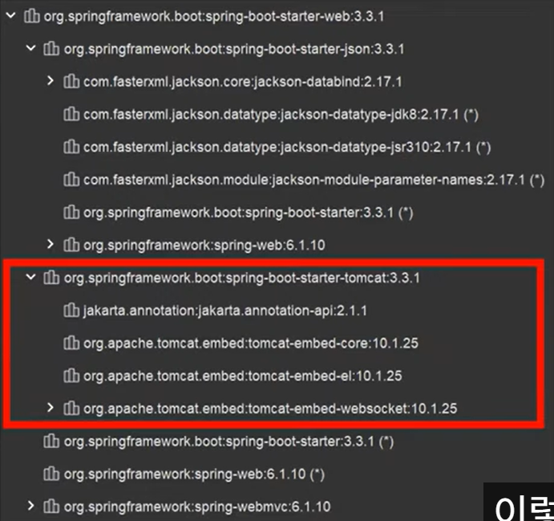

# **Spring Boot**

---

- **스프링 기반 애플리케이션을 편하고 빠르게 개발할 수 있도록 도와주는 도구**
- <strong style="color:red">최소한의 설정</strong>으로 스프링 애플리케이션을 개발할 수 있도록 하는 것이 모토

---

### 1. **stand-alone**
- 독립 실행형 스프링 애플리케이션을 개발할 수 있음
  > **스프링 부트 이전의 배포 과정**
    > 1. WAS를 설치 및 설정
    > 2. 개발한 애플리케이션을 WAR 형식으로 패키징
    > 3. WAS에 배포
    > 
  > -> WAS 관련 설정, WAR 형식의 디렉터리 구조 등에 대한 이해 필요 

- 독립 실행형 스프링 애플리케이션을 개발 가능
  > **스프링 부트 등장**
  > - 서버에 별도의 WAS를 설치하지 않아도 개발을 시작할 수 있게 됨
  > - WAS 관리 등 번거로운 작업에 대한 부담이 줄어듦
- 내장 서버 지원
  > 내장 톰캣과 같은 재아 서버를 라이브러리 형태로 함께 패키징 하면?
  >- 애플리케이션 자체가 <strong style="color: red">실행에 필요한 모든 요소를 갖추고 있는 상태</strong>
  > 
  > 스프링 부트는 앱 시작 시점에 내장 서버를 초기화 및 실행
  > 
  > 원하는 환경 어디에서든 <strong style="color: red">독립적</strong>으로 실행 가능

### 2. **opinionated**
- 강한 견해를 가진 스프링 부트
    > 기본적으로 스프링 프레임워크는 매우 자유로운 선택지 제공
    >  
    > 어떤 라이브러리를 어떻게 사용할지 개발자가 원하는대로 정할 수 있음
    >
    > 엄청난 강점이지만, 빠른 애플리케이션 개발을 방해하는 요소가 될 수 있음   
    >
    > <strong style="color: red">Best-Practice라고 알려진 라이브러리 조합</strong>을 미리 모아둔 것
    >
    > starter 의존성만 추가하면, 일단 개발을 시작하는데 필요한 의존성을 한 번에 가져올 수 있음
    >
    > 프로젝트 초기 생성 시 의사결정 과정을 생략하고, 빠르게 개발을 시작
    >
- spring-boot-starter-web - Dependency

    

    > 웹 애플리케이션 개발에 필요한 기본적인 의존성을 한 번에 가져옴
    >
    > 스프링 부트는 starter를 제공해 편하게 프로젝트 초기 의존성을 설정할 수 있게 함
- 의존성 버전 관리
  > 스프링 부트는 자주 사용되는 라이브러리의 <strong style="color: red">버전 호환성을 미리 검증</strong>해두고, 사용할 버전을 자동으로 정해줌
  >
  > 개발자가 버전 호환성을 일일이 체크하지 않아도 개발을 진행할 수 있음   
### 3. **auto-configuration**
- auto-configuration(자동 구성)
    > 필요한 스프링 빈들을 자동으로 등록해주는 기능
    >
    > 개발자가 스프링 빈을 하나하나 등록해야 하는 수고를 덜 수 있음
- 일반적인 스프링 빈 등록 과정
    > 1. 스프링 컨텍스트가 생성될 때
    > 2. `@Configuration` 이 적용된 설정 클래스를 읽고,
    > 3. `@Bean` 이 적용된 메서드를 실행해 반환된 객체를 빈으로 등록
- 자동 구성 스프링 빈 등록
    > 1. classpath에 존재하는 모든 라이브러리 순회
    > 2. 각 라이브러리의 <strong style="color: red">특별한 파일</strong>을 읽어옴 
    > 3. 읽어온 정보를 바탁으로 어떤 설정 클래스를 사용할지 선택
    > 4. 이후 설정 클래스의 `@Bean` 이 적용된 메서드를 실행하며, 반환된 객체를 빈으로 등록
- `org.springframework.boot.autoconfigure.AutoConfiguration.import`
    > 자동 구성에 사용할 <strong style="color: red">설정 클래스`(@Configuration)`의 className을 모아둠</strong>
    >
    > 스프링 빈을 등록할 때 어떤 설정 파일을 사용할지, 후보군을 적어둔 것
- ImportSelector
    > <strong style="color: red">동적</strong>으로 설정 파일`(@Configuration)`을 읽어올 수 있도록 하는 인터페이스
    >
    > 구현체는 `selectImports()` 메서드를 구현해야 함.
    >
    > 이 때 `selectImports()` 는 사용할 설정 클래스들의 className을 담은 배열 반환
- `AutoConfigurationsImportSelector`
    > 스프링 부트는 자동 구성을 위한 `AutoConfigurationsImportSelector`를 제공
- spring-boot-autoconfigure
    > 자주 사용되는 라이브러리의 경우, spring-boot-autoconfigure에서 해당 라이브러리의 자동 구성 설정 클래스를 제공
    >
    > `org.springframework.boot.autoconfigure.AutoConfiguration.imports` 에 해당 설정 클래스의 이름이 명시되어 있음

## **정리**
### 1.stand-alone
> 내장 서버를 지원해, WAS에 대한 관리를 신경쓰지 않고도 독립 실행 가능한 스프링 애플리케이션을 만들 수 있음
>

### 2. opinionated
> 강한 견해를 가진 스프링 부트의 starter와 의존성 버전 관리 기능
> 
> 의사 결정 과정을 생략하고 일단 개발을 시작할 수 있음

### 3. auto-configuration
> 필요한 빈을 자동으로 스프링 컨테이너에 등록해주는 기능을 제공
>
> 일일히 빈을 등록하지 않아도 되어, 개발에만 집중할 수 있게 됨

출처 : [우아한 테크](https://www.youtube.com/watch?v=XRyt-2BOkAI)